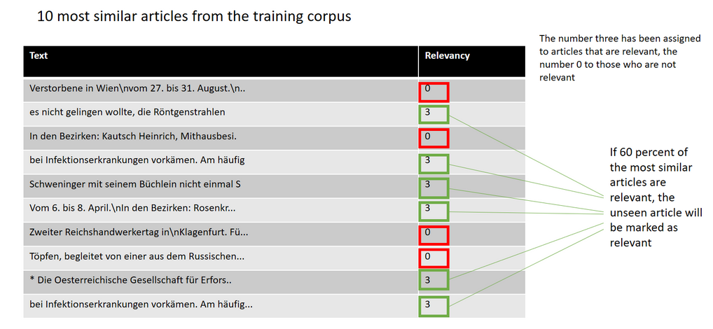

# Using LDA and Jensen-Shannon Distance (JSD) to group similar newspaper articles

Many researchers have the problem that their data sets contain articles that are irrelevant to their research question. For many reserarch topics, search requests are difficult to define conceptually and hard, if not impossible, to trace by a simple keyword search alone. Additionally, when building topic-specific corpora using queries, there is always a compromise between the precision and the recall of such search queries. In other words, on one hand, there is a conflict between creating a corpus that contains only relevant texts but not all texts available in the entire collection are relevant. For example, if the goal is to find articles on return migration, researchers have to deal with some ambiguous search terms. The German words "Heimkehr" (returning home) or "Rückkehr" (returning back) lead to many articles that are relevant to the research question, but also to articles that are not relevant (e.g. return from a mountain tour, work, etc.). By using topic models and document similarity measurements, this notebook allows to exclude these articles without combining the the terms "Heimkehr", "Rückkehr", "Rückwanderung", "Rückwanderer" or "Rückkehrer" with other search terms.

The main purpose of this notebook is to consider the context of a search query (in this case the whole content of a newspaper clipping where the keyword appears) to measure the relevance, on the other hand, can make the search less influenced by the researcher's prior knowledge and avoid a too narrow tunnel vision.

#### So how is this working? 

Given a manually annotated collection of articles containing relevant as well as non relevant articles, this program will get the topic distribution of each document using LDA (gensim library). These topic distributions serve as a comparison for other, unseen articles, in order to automatically distinguish between relevant and non-relevant articles. The annotations are used for evaluation and counting the relevance probability for an unseen article. 

For the comparison, the Jensen-Shannon distance method is used to measure the similarity between the topic distribution of an unseen article and the topic distribution of the training corpus. Therefore, the topic distribution of each new article will be compared to the topic distribution of the articles in the trained corpus. Then, for each unseen article, the 10 most similar articles from the training corpus are being extracted. These articles carry the information about the manually assigned relevancy. If 60 precent of the automatically found similar articles were annotated as relevant, the new article will be marked as relevant. Otherwise it will be marked as irrelevant. Using two different datasets (one about cancer and one about return migration), the average score of correct selected articles is between 80 and 90 percent. 

